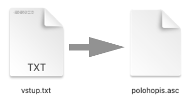

# Allplan DMT parser

## create .asc file from .txt file for use in Allplan DMT
- Script works even offline, no data are being send outside a computer
- User is working with only one file from web browser

### UseCase (Main goal)
When working with Allplan DMT you need `.asc` file. That can be created from given `.txt` file by changing suffix, but also some limitations are given from Allplan on the file. This script automates some routine actions:
- comparison of data into equivalent rows
- removing characters from file
- axis negation (x, y)
- giving each point a number code value (if it has one)

## Parsing final file
To make working with this tool more accesible, it is possible to create **ONE** `.html` file. (Python version must be at least 3.10)
- download copy of all files into one folder
- in command line run `python parse.py`
- in current direcory will be created new file `Otevri_Mne_V_Internetovem_Prohlizeci.html`. This file can be sent / saved anywhere you want (even offline).

## Workflow
1. Open `Otevri_Mne_V_Internetovem_Prohlizeci.html` in your web browser (javascript must be enabled)
2. Import your `.txt` file
    - You can turn of axis negation, or choose your own column separator (default is 1 space " ")
3. "traffic light" in upper right corner says if all tests for input data went OK, possibly what is wrong eith input data (on cursor hover will be shown more information)
4. After succesfull import of data
    - `.asc` file will be automatically downloaded
    - in upper right corner in "?" button will now be visible, how to configure Allplan settings for import to go well (+ number codes for char codes in input `.txt` file)
5. Import `asc.` file to Allplan
